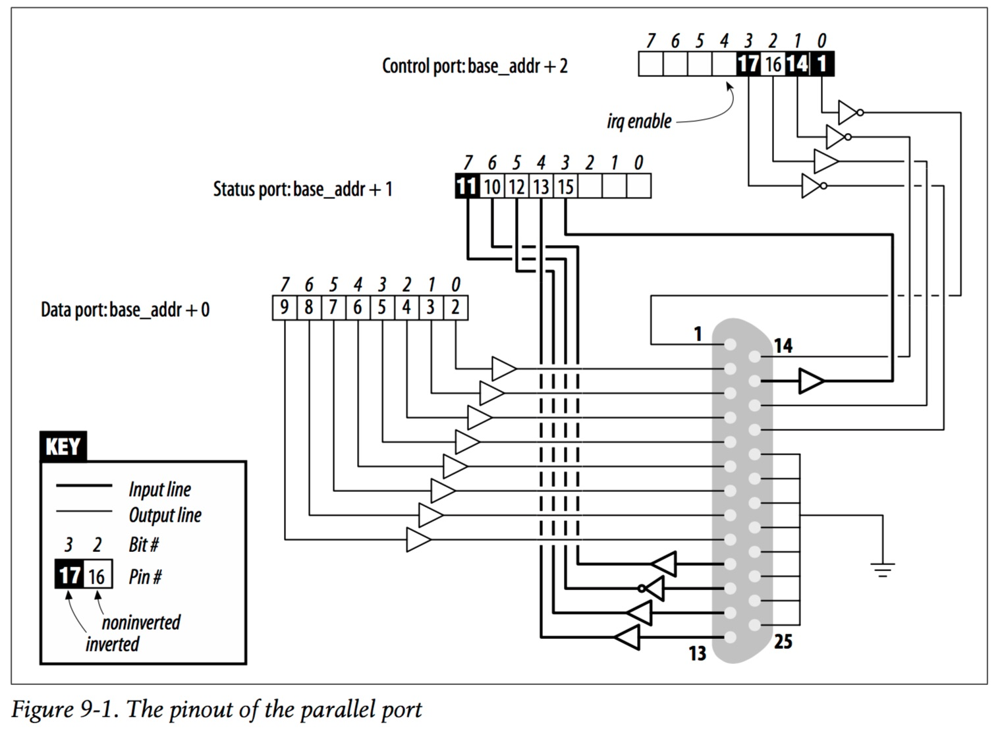

# Ch10.中斷處理

CPU不可能枯等Devices的events，因此OS必須要提供一種方式讓Device發生event時能夠通知CPU。這種通知方式我們稱為**interrupt。**

在user-space使用的software interrupt\( trap or exception \)是使用signal。在Linux處理interrupt的方式跟sin gal一樣，device只需要使用handler就可以在CPU收到device發出interrupt的時候，執行driver所註冊的ISR\(interrupt service routine\)。最後，ISR有個重要的特點，也就是它本身要能與其他的process同時執行，因此他必定會面對concurrent問題，以及hardware資料結構的race condition。

---

## Preparing the Parallel Port

這邊interrupt使用前一張提出的short模組(Parallel Port)來示範，因為不interrupt不使用hardware的話，是無法發出訊號的。
大多數device若沒有事先設定，通常是不會主動發出interrupr。然而Parallel Port可以設立port2(0x37a, 0x27a)的bit 4，可以開啟interrupt的reporting。在short.c當中，是使用`outb()`來設定此bit。  

```c
void outb(unsigned char value, unsigned short int port);
/*DESCRIPTION
   This family of functions is used to do low-level port input and  output.
   The  out* functions do port output, the in* functions do port input; the
   b-suffix functions are byte-width and the w-suffix functions word-width;
   the _p-suffix functions pause until the I/O completes.*/
```  
  
當interrupt功能被開啟後，parallel interface會在pin 10(the so-called ACK bit)發生了electrical signal(電壓由low到high)的時候產生了一個interrupt signal。
由此可知，引起interrupr的最簡單方式是將pin 9跟pin 10連接起來。只要data的MSB (most significant bit)也就是pin 9，只要將資料寫入到/dev/short0，就可以產生interrupr。但是寫入的資料室ASCII將無法產生interrupr，這是因為ASCII的MSB都是0。   

  

---
## Installing an Interrupt Handler

System上必須要有___interrupt handler___(___interrupt service routine，ISR___)才能夠處理interrupt。若是沒有相對應的ISR，則CPU只會回傳ACK signal給device，當作處理interrupt的方式。
在某些PC上interrupt channel(___interrupt request，IRQ___)只有15或16條，所以需要小心處理避免浪費。而Linux kernel內部有一個registry of interrupt lines，用來記錄IRQ跟ISR之間的對應。若要使用特定的IRQ module的話，就必須先向kernel註冊。大部分情況底下，module會傾向多個drivers共用一組IRQ。

```C
#include <linux/interrupt.h>
int request_irq(unsigned int irq,
                irqreturn_t (*handler)(int, void *, struct pt_regs *),
                unsigned long flags,
                const char *dev_name,
                void *dev_id);
void free_irq(unsigned int irq, void *dev_id);
```

透過`request_irq`來註冊IRQ，並且在失敗的時候會取得負數的錯誤碼，常見的錯誤碼是 -EBUSY，這是IRQ已經被其他driver給佔用。並使用`free_irq`來歸還已註冊的IRQ。
```c
unsigned int irq
```
想要取得的interrupt編號。
```c 
irqreturn_t (*handler)(int, void *, struct pt_regs *)
```
指向要被處理的ISR function。
```
unsigned long flags
//-------------------------
SA_INTERRUPT     表示要安裝的ISR是快速型，在中段失效期間執行完ISR的工作
SA_SHIRQ         代表是否可以被不同device共享
SA_SAMPLE_RANDOM 表示interrupt對entropy pool有所貢獻(幫助產生亂數)，並且被使用在/dev/random和/dev/urandom
                 在有週期性的或是可能被攻擊的device不得設立此flag
```
關於管理中斷選項的mask。
```c
const char *dev_name
```
這字串被使用在/proc/interrupts底下，用來表示ISR。
```c
void *dev_id
```
一個識別碼，用來共享IRQ。在free_irq會使用到。  
此辨識碼可用來辨識是哪一個device發出的interrupr。若想要獨佔IRQ，可將此識別碼設為NULL，也可將它指向device struct。
    
IRQ盡量在要使用的時候才去註冊ISR，因為IRQ是限量的，若在一開始就註冊很容易閒置而浪費。所以在device第異次被啟用時才註冊IRQ，這樣可以減少佔用浪費的情況。以下是一個只有快速型的範例：
```c
if (short_irq >= 0) {
   result = request_irq(short_irq, short_interrupt,
   SA_INTERRUPT, "short", NULL);
   if (result) {
       printk(KERN_INFO "short: can't get assigned irq %i\n",
              short_irq);
       short_irq = -1;
   }
   else { /* actually enable it -- assume this *is* a parallel port */
       outb(0x10,short_base+2);
       //short_base是parell interface的I/O起始位址，寫入port2
       //寫入0x10(register2)，可以開啟回報interrupt
   }
}
```
#### The /proc Interface  
 當CPU接收到hardware interrupt時，對應的IRQ中的counter就會被累加一次。可以從/proc/interrupts當中看各個device的出中斷次數。ˋ面試書上的範例：  
```bash
root@montalcino:/bike/corbet/write/ldd3/src/short# m /proc/interrupts  
#IRQ編號                      觸發方式        ISR名稱
            CPU0       CPU1   
  0:      4848108        34  IO-APIC-edge    timer      
  2:            0         0  XT-PIC          cascade  
  8:            3         1  IO-APIC-edge    rtc  
 10:         4335         1  IO-APIC-level   aic7xxx  
 11:         8903         0  IO-APIC-level   uhci_hcd  
 12:           49         1  IO-APIC-edge    i8042  
NMI:            0         0  
LOC:      4848187   4848186  
ERR:            0  
MIS:            0  
```
Linux盡量讓interrut集中在CPU0，主要是因為想提升cache的hit rate。在大型系統當中，有時也會分散interrupt在不同CPU來減少ISR的負擔。觸發方式事kernel跟PCI之間都行為。       

/proc/stat記錄了以較低階的interrupt次數資訊。裡面記載了開機到現在的資訊，而/proc/interrupts只會記錄開機到現在目前在使用的device的次數。這兩個檔案還有另一個差異的地方，也就是proc/interrupts跟平台(IA-64 x86 etc.)無關。Linux對於IRQ數量的限制是平台架構上的限制，並非機型的限制。

#### Autodetecting the IRQ Number

有兩種方式可以找出目標device的IRQ，第一種是要user在載入module時只定IRQ number，但是user通常不知道IRQ number(可能device不是user設定或是device沒有jumperless)。所以第二種，自動探測IRQ的功能就被提出。  
在x86架構中，第一組Serial port的慣例是0x3F8(I/O-based address)，和IRQ 4的組合。第二組Serial port是0x2F8和IRQ 3組合。所以只要知道I/O-based address就可以得到對應的IQR。像是下面例子:
```c
if (short_irq < 0) /* not yet specified: force the default on */
 switch(short_base) {
 case 0x378: short_irq = 7; break;
 case 0x278: short_irq = 2; break;
 case 0x3bc: short_irq = 5; break;
 }
```
探測的方法有兩種:
* Kernel-assisted probing

Linux提供了一組僅適用於獨佔而不共用的中斷，因為支援共用interrupt的device童常會提供其他管道讓device driver知道device的IRQ。  

```c
include <linux/interrupt.h>;
unsigned long probe_irq_on(void);
```
回傳一個mask，表示尚未被佔用的IRQ。在呼叫`probe_irq_on`後，device至少要發出一次中斷。在呼叫`probe_irq_off`之前必須關掉interrupt。
```c
int probe_irq_off(unsigned long);
```
知道了IRQ之後，device driver可以呼叫此function，並且回傳由`probe_irq_on`所得到的mask。但是在呼叫`probe_irq_on`跟回傳mask之間沒有interrupt，則`probe_irq_off`會回傳0。若是超過一次以上的interrupt就會回傳負數，因為可能同時觸發多個devices。  
  
以下示範利用`probe_irq_on`跟`probe_irq_off`來輔助。
```c
int count = 0;
do {
   unsigned long mask;
   mask = probe_irq_on( );
   outb_p(0x10,short_base+2); /* enable reporting */
   outb_p(0x00,short_base); /* clear the bit */
   outb_p(0xFF,short_base); /* set the bit: interrupt! */
   outb_p(0x00,short_base+2); /* disable reporting */
   udelay(5); /* give it some time */
   short_irq = probe_irq_off(mask);
   if (short_irq = = 0) { /* none of them? */
     printk(KERN_INFO "short: no irq reported by probe\n");
     short_irq = -1;
   } /*
      * if more than one line has been activated, the result is
      * negative. We should service the interrupt (no need for lpt port)
      * and loop over again. Loop at most five times, then give up
      */
} while (short_irq < 0 && count++ < 5);
if (short_irq < 0)
   printk("short: probe failed %i times, giving up\n", count);
```
在許多平台上Kernel-assisted probing只是空殼。總而言之，這是一種小聰明的方法。
* Do-it-yourself probing          
可由driver自動完成。如果使用probe=2(short module)載入module時，driver會probing IRQ的值。    
先啟動尚未使用的interrupt，用parallel device來說，IRQ必為3、5、7、9的其中一個，因此我們只要probing這四個即可。  
下面可以看到handler，使用來probing ISR。也就是當收到interrupt時，`short_probing()`就會更改`short_irq`的值。
```c
irqreturn_t short_probing(int irq, void *dev_id, struct pt_regs *regs)
{
   if (short_irq = = 0) short_irq = irq; /* found */
   if (short_irq != irq) short_irq = -irq; /* ambiguous */
   return IRQ_HANDLED;
}
```
下面可以看到，這邊使用trials來記錄要被測試的IRQ，並將註冊須可放到tried當中。在do...while當中去觸發interrupt，然後handler會去更動short_irq，這樣就可以得知IRQ。我也們可以測試所有IRQ，在`<asm/irq.h>`當中有記錄IRQ的個數(`NR_IRQS`)。
```c
int trials[ ] = {3, 5, 7, 9, 0};
int tried[ ] = {0, 0, 0, 0, 0};
int i, count = 0;
/*
 * install the probing handler for all possible lines. Remember
 * the result (0 for success, or -EBUSY) in order to only free
 * what has been acquired
 */
for (i = 0; trials[i]; i++)
   tried[i] = request_irq(trials[i], short_probing,
                          SA_INTERRUPT, "short probe", NULL);
do {
   short_irq = 0; /* none got, yet */
   outb_p(0x10,short_base+2); /* enable */
   outb_p(0x00,short_base);
   outb_p(0xFF,short_base); /* toggle the bit */
   outb_p(0x00,short_base+2); /* disable */
   udelay(5); /* give it some time */
   /* the value has been set by the handler */
   if (short_irq = = 0) { /* none of them? */
     printk(KERN_INFO "short: no irq reported by probe\n");
   }
   /*
   * If more than one line has been activated, the result is
   * negative. We should service the interrupt (but the lpt port
   * doesn't need it) and loop over again. Do it at most 5 times
   */
} while (short_irq <=0 && count++ < 5);
/* end of loop, uninstall the handler */
for (i = 0; trials[i]; i++)
   if (tried[i] = = 0)
     free_irq(trials[i], NULL);
if (short_irq < 0)
 printk("short: probe failed %i times, giving up\n", count);
```
